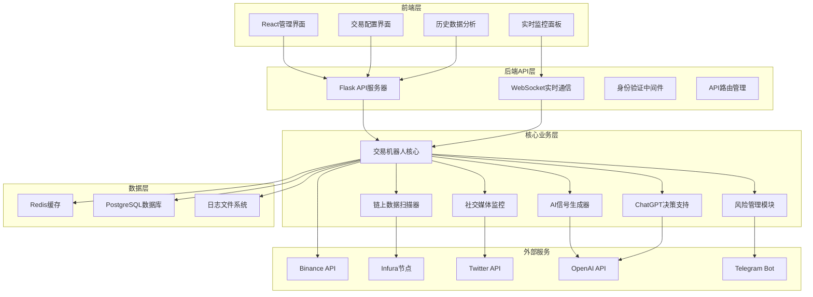

# Meme币自动化交易机器人系统架构设计

## 1. 系统概述

本系统是一个完整的Meme币自动化交易解决方案，集成了AI信号生成、链上数据扫描、社交媒体监控和ChatGPT决策支持等功能。系统采用前后端分离的架构设计，提供Web管理界面和RESTful API接口，便于管理维护和扩展。

## 2. 系统架构图



## 3. 技术栈选择

### 前端技术栈
- **React 18**: 现代化的前端框架，提供组件化开发
- **TypeScript**: 类型安全的JavaScript超集
- **Ant Design**: 企业级UI组件库
- **Chart.js**: 数据可视化图表库
- **Socket.io-client**: WebSocket客户端通信
- **Axios**: HTTP客户端库

### 后端技术栈
- **Flask**: 轻量级Python Web框架
- **Flask-SocketIO**: WebSocket支持
- **Flask-JWT-Extended**: JWT身份验证
- **SQLAlchemy**: ORM数据库操作
- **Redis**: 内存缓存和消息队列
- **Celery**: 异步任务队列
- **Gunicorn**: WSGI HTTP服务器

### 数据库和缓存
- **PostgreSQL**: 主数据库，存储交易记录、配置信息
- **Redis**: 缓存层，存储实时数据和会话信息
- **InfluxDB**: 时序数据库，存储价格和指标数据

## 4. 模块设计

### 4.1 前端模块设计

#### 主要页面组件
1. **仪表板页面** (`Dashboard.tsx`)
   - 实时交易状态监控
   - 关键指标展示
   - 盈亏统计图表

2. **交易配置页面** (`TradingConfig.tsx`)
   - 交易参数设置
   - 风险管理配置
   - API密钥管理

3. **信号监控页面** (`SignalMonitor.tsx`)
   - AI信号实时展示
   - 社交媒体情绪分析
   - 链上数据监控

4. **历史分析页面** (`HistoryAnalysis.tsx`)
   - 交易历史记录
   - 性能分析报告
   - 策略回测结果

### 4.2 后端API模块设计

#### API路由结构
```
/api/v1/
├── auth/
│   ├── login
│   ├── logout
│   └── refresh
├── trading/
│   ├── status
│   ├── config
│   ├── start
│   ├── stop
│   └── history
├── signals/
│   ├── ai-signals
│   ├── social-sentiment
│   └── onchain-data
├── monitoring/
│   ├── performance
│   ├── logs
│   └── alerts
└── admin/
    ├── users
    ├── settings
    └── system-info
```

### 4.3 核心业务模块集成

#### 交易机器人核心集成
- 将现有的交易机器人核心逻辑封装为服务类
- 提供统一的接口供API调用
- 实现异步任务处理和状态管理

#### 实时数据流处理
- 使用WebSocket实现前后端实时通信
- 集成Redis发布/订阅模式处理实时数据
- 实现数据流的缓冲和批处理机制

## 5. 部署架构设计

### 5.1 容器化部署
- 使用Docker容器化所有服务组件
- 采用Docker Compose进行多服务编排
- 实现服务间的网络隔离和通信

### 5.2 负载均衡和高可用
- 使用Nginx作为反向代理和负载均衡器
- 实现API服务的水平扩展
- 配置健康检查和自动故障转移

### 5.3 监控和日志
- 集成Prometheus和Grafana进行系统监控
- 使用ELK Stack进行日志收集和分析
- 实现告警机制和通知系统

## 6. 安全设计

### 6.1 身份验证和授权
- 实现JWT令牌认证机制
- 采用RBAC角色权限控制
- API密钥加密存储和管理

### 6.2 数据安全
- 敏感数据加密存储
- API通信使用HTTPS加密
- 实现API访问频率限制

### 6.3 风险控制
- 交易金额和频率限制
- 异常行为检测和自动停止
- 多重签名和审批机制

## 7. 性能优化

### 7.1 数据库优化
- 索引优化和查询性能调优
- 读写分离和分库分表策略
- 连接池和缓存策略优化

### 7.2 缓存策略
- 多级缓存架构设计
- 热点数据预加载
- 缓存失效和更新策略

### 7.3 网络优化
- CDN加速静态资源
- API响应压缩和优化
- 长连接和连接复用

## 8. 扩展性设计

### 8.1 微服务架构
- 服务拆分和边界定义
- 服务间通信协议设计
- 服务注册和发现机制

### 8.2 插件化架构
- 策略插件接口设计
- 数据源插件扩展机制
- 通知渠道插件化

### 8.3 多链支持
- 区块链适配器模式
- 统一的链上数据接口
- 跨链交易协调机制

